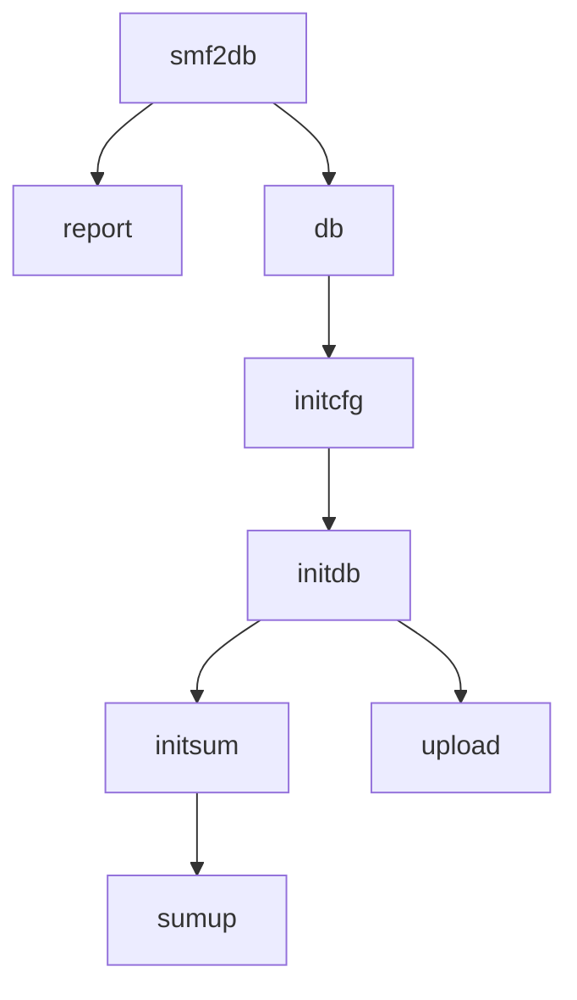

# Smf2db


[](https://choosealicense.com/licenses/mit/)

This is a CLI application that does upload SMF JSON files to database, summarization and printing reports on the fly without any DBMS.


**Table of Contents**

- [Prerequisites](#prerequisites)
- [Installation](#installation)
- [Usage](#usage)
- [Technologies](#technologies)
- [Features](#features)
- [Contact](#contact)
- [Change log](#change-log)
- [License](#license)

## Prerequisites

Before you begin, ensure you have met the following requirements:
* Python 3.11 or later installed on your platform
* Ensure you have created a virtual environment
* Get ready of SMF JSON files (you can follow the instructions of my another project in [CBTTape](https://cbttape.org/ftp/cbt/CBT1064.zip)) 

## Installation

**smf2db** is officially distributed for installation through [PyPI](https://pypi.org/project/smf2db) for installation with pip.
To install **smf2db**, follow these steps:

### On z/OS:

Ensure you download the wheel file and upload to USS before beginning. The requirements for intalling`smf2db`are as follows:
- Python installed
- Can access [Python AI Tookit for IBM z/OS](https://ibm-z-oss-oda.github.io/python_ai_toolkit_zos/) to get pre-built Python packages for z/OS.
- Can access [PyPI](https://pypi.org) to get other dependent packages. It is optional as the required wheel files will be included in the pax file when expanding it.

If installing from wheel file, you can run this:
```
python -m pip install smf2db-0.1.0-py3-none-any.whl
```

For more detail instructions, please refer to the project's official [documentation](https://docs.readthedocs.com/dev/stable/tests.html).

### On macOS, Linux and Windows:
**smf2db** can be installed with [pip](htps://pip.pypa.io/len/stable/) like this:

```
python -m pip install smf2db
```

## Usage

### On z/OS:
There are two methods to run smf2db:
- Using batch job
- firing up a telnet terminal window and run the following command:
    ```
    $ smf2db --version
    ``` 

### On macOS, Linux and Windows:
You can just run the following command on the terminal:
```
$ smf2db --version
```

Here are flowchart of how to use the smf2db:



### Usage Examples

If you have some smf70 JSON data on hand for the LPAR, e.g. ``S0W1``, in ``json_data`` directory, you can just print the report on the fly 
by running the following command without any DBMS involvement:
```
smf2db report 70 json_data/smf70.json -r 'CPU Activity report' -l S0W1
```

If you would like to upload data to DBMS, say, SQLite, you are required to run ``db initcfg`` to create a yaml 
configuration file first. Here we will create a ``config.yaml`` in ``configs`` directory with the SQLite db path 
in ``data`` directory which has already created. The ``partition scheme`` is a single database without any partition and 
without any prefix for the database names. The command is shown below:
```
smf2db db initcfg --config_file configs/config.yaml --db_driver sqlite --sqlite_path data --partitions 'no partition' -x ''
```

After creation of the configuration file, you can now initialize the database in SQLite by creating the tables in 
the database. Let's initialzie smf type 70:
```
smf2db db initdb 70 --config_file configs/config.yaml
```

To upload smf70 JSON data in ``json_data/smf70.json`` to SQLite, you can simply run:
```
smf2db db upload 70 json_data/smf70.json --config_file configs/config.yaml
```

For more detail how to use it, please refer to the project's official [documentation page](https://smf2db.readthedocs.io).

## Technologies

**smf2db** uses the following technologies and tools:

- [Python](https://www.python.org/): 
- [SQLAlchemy](https://www.sqlalchemy.org/): 
- [PostgreSQL](https://www.postgresql.org/): 

## Features

**smf2db** currently supports SMF types 30, 70-75, 77, 78, 110 and 123 and has the following
set of features:

- Printing reports on the fly using the JSON files as input without loading to DBMS. It is 
  recommended to output the report to a file for easier browsing.
- Uploading JSON files to Database (SQLite or Postgresql). You can use SSH to connect to 
  Postgresql if SSH is supported on your platform.
- Suming up data to hourly or daily database. 15-minutes sum-up is available for some
  SMF types.

## Contact

If you want to contact me you can reach me at <franfwong@hotmail.com>.

## Change log

- 0.1.0
    - The first proper release

## License

This project uses the following license: [`LICENSE`](LICENSE.md).